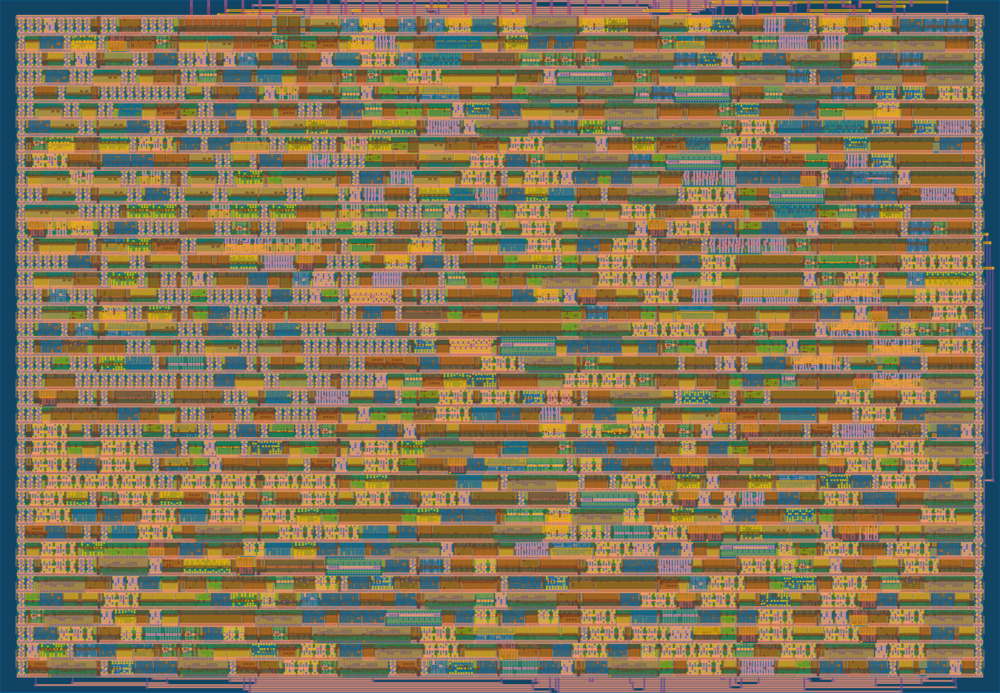

The primary usecase for this project is to create hardware LLM accelerators (and other uses of large scale matrix multiplication).

For an overview of the process for making a microchip see [Designing Silicon from Scratch by Breaking Taps](https://youtu.be/q6ytRHaTEXI) and consider doing the [Zero to ASIC course](https://www.zerotoasiccourse.com/) (like I did).

An implementation of an Exact [Dot Product](https://en.wikipedia.org/wiki/Dot_product) in verilog. This is aimed at 8bit floating point formats to fit [tinytapeout](https://tinytapeout.com/) but is parameterisable for use in FPGAs or custom tapeouts at higher precision.

"Exact" in the sense that it uses fixed point accumulation and there is a single rounding at the end, such that calculation order doesn't matter, e.g. (simplified)

```
1000 + 0.0001 + 0.0001 - 1000
=>   0.0002
```

whereas rounding after each multiply into a register could yield an answer of `0.0`

There is no limit to the size of the input vectors, an element is added on every clock cycle and the accumulated result always available.

This single (stateful) instruction can be used to build `MULT`, `ADD`, `FMADD`, `SUB`, `FMSUB` instructions for hobby 8bit computers such as the [`@beneater`](https://www.youtube.com/@BenEater/playlists) 8-bit or 6502. And can also be used as the basis of efficient matrix multiplication for scientific computations and machine learning.

This component could be duplicated (many times) as part of a larger design in a systolic array to build a TPU for large scale matrix multiplication.

### Design

The [Handbook of Floating-Point Arithmetic](https://link.springer.com/book/10.1007/978-3-319-76526-6) (Muller et al) gives a description of a typical hardware floating point MULT and ADD. Bizarrely, a fixed point accumulating multiply is simpler than a rounded one, since we do not need to consider the case when the numbers are at a different scale. Instead, we simply expand every number into its exact representation (roughly 64 bits for 8 bit floating point inputs, and several kilobits for double precision floating point numbers) and perform integer ADD and MULT on an aggregator. Multi-layer cache solutions have been proposed [by Koenig](http://www2.eecs.berkeley.edu/Pubs/TechRpts/2018/EECS-2018-51.html) for the higher precision bits, but this implementation just keeps it simple by using internal registers, so it's quite big.

There is no attempt to optimise the upper bound on the clock frequency. It may be possible to redesign the phases of this computation such that answers are available several clock cycles after the inputs are provided, in order to consume more inputs within the same amount of time.

### Developers

To get setup you must have `python3`, `iverilog`, `verilator` and `docker` installed. To install local dependencies

```
make deps
```

To run the tests

```
make test
```

To do the lengthy verification steps and produce a GDS (this will do some big downloads on first run, and requires docker to be running)

```
make harden
```

Look in `runs/wokwi/` for errors/warnings. Diagnostics are available with

```
.venv/bin/python tt/tt_tool.py --print-warnings
.venv/bin/python tt/tt_tool.py --print-stats
.venv/bin/python tt/tt_tool.py --print-cell-summary
.venv/bin/python tt/tt_tool.py --print-cell-category
```

To render an image try

```
make render
```



and also look under `docs/netlist.svg`

The final output is in `runs/wokwi/final/` (GDS, LEF, netlists).

### Optimisations

TODO perf

Add this to `src/config.json`) to use a faster adder type to trade space for speed:

```
"SYNTH_ADDER_TYPE": "CSA",
```

### In Progress

TODO how do we see our frequency limits?

TODO use https://gds-explorer.tinytapeout.com/ to render a video

TODO can we render to PCB with ICs?
