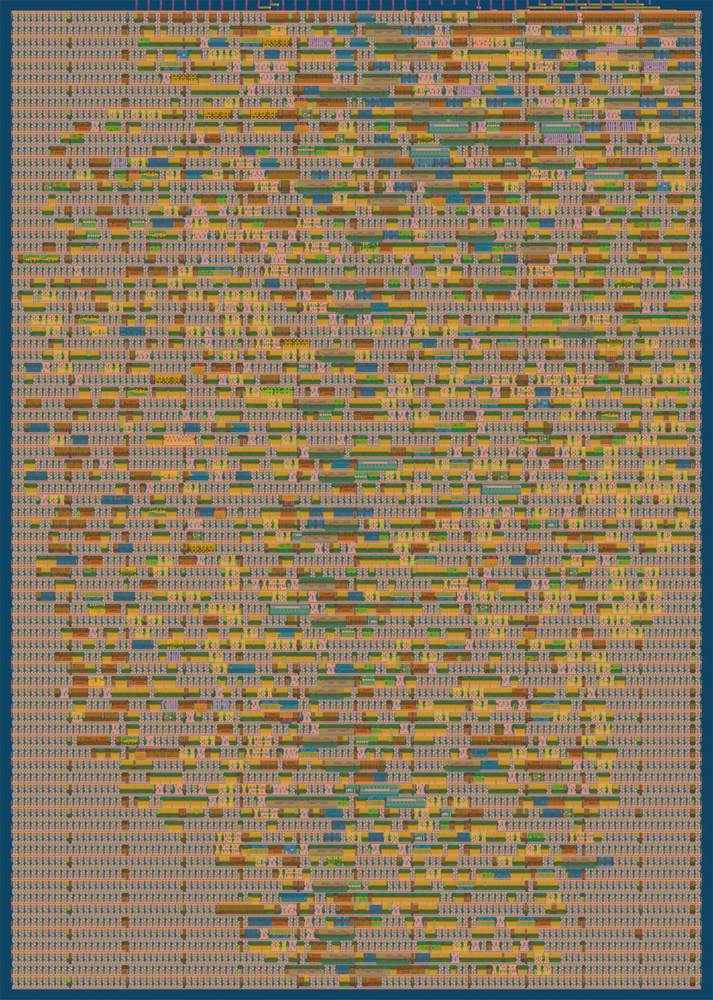

The primary usecase for this project is to create hardware LLM accelerators (and other uses of large scale matrix multiplication).

For an overview of the process for making a microchip see [Designing Silicon from Scratch by Breaking Taps](https://youtu.be/q6ytRHaTEXI) and consider doing the [Zero to ASIC course](https://www.zerotoasiccourse.com/) (like I did).

An implementation of an Exact [Dot Product](https://en.wikipedia.org/wiki/Dot_product) in verilog. This is aimed at 8bit floating point formats to fit [tinytapeout](https://tinytapeout.com/) but is parameterisable for use in FPGAs or custom tapeouts at higher precision.

"Exact" in the sense that it uses fixed point accumulation and there is a single rounding at the end, such that calculation order doesn't matter, e.g. (simplified)

```
1000 + 0.0001 + 0.0001 - 1000
=>   0.0002
```

whereas rounding after each multiply into a register could yield an answer of `0.0`

There is no limit to the size of the input vectors, an element is added on every clock cycle and the accumulated result always available.

This single (stateful) instruction can be used to build `MULT`, `ADD`, `FMADD`, `SUB`, `FMSUB` instructions for hobby 8bit computers such as the [`@beneater`](https://www.youtube.com/@BenEater/playlists) 8-bit or 6502. And can also be used as the basis of efficient matrix multiplication for scientific computations and machine learning.

This component could be duplicated (many times) as part of a larger design in a systolic array to build a TPU for large scale matrix multiplication.

### Design

The [Handbook of Floating-Point Arithmetic](https://link.springer.com/book/10.1007/978-3-319-76526-6) (Muller et al) gives a description of a typical hardware floating point MULT and ADD. Bizarrely, a fixed point accumulating multiply is simpler than a rounded one, since we do not need to consider the case when the numbers are at a different scale. Instead, we simply expand every number into its exact representation (roughly 64 bits for 8 bit floating point inputs, and several kilobits for double precision floating point numbers) and perform integer ADD and MULT on an aggregator. Multi-layer cache solutions have been proposed [by Koenig](http://www2.eecs.berkeley.edu/Pubs/TechRpts/2018/EECS-2018-51.html) for the higher precision bits, but this implementation just keeps it simple by using internal registers, so it's quite big.

There is no attempt to optimise the upper bound on the clock frequency. It may be possible to redesign the phases of this computation such that answers are available several clock cycles after the inputs are provided, in order to consume more inputs within the same amount of time.

### Developers

To get setup you must have `python3`, `iverilog`, `verilator` and `docker` installed. To install local dependencies

```
make deps
```

To run the tests

```
make test
```

To do the lengthy verification steps and produce a GDS (this will do some big downloads on first run, and requires docker to be running)

```
make harden
```

Look in `runs/wokwi/` for errors/warnings. Diagnostics are available with

```
make stats
```

To render an image try

```
make render
```



and also look under `docs/netlist.svg`

The final output is in `runs/wokwi/final/` (GDS, LEF, netlists).

### Timing and Optimisations

An estimate of maximum clock frequency is `1 / (CLOCK_PERIOD − WNS)`.

`src/config.json` sets `CLOCK_PERIOD: 20` (20 ns, 50 MHz)

`WNS` (worst negative slack) is obtained from looking at the output of `runs/wokwi/*-openroad-stapostpnr/summary.rpt`

The `fmax.py` script will automatically produce reports for each "corner" and at different temperatues

```
# Routing stats

| Utilisation (%) | Wire length (um) |
|-------------|------------------|
| 78.509 % | 54459 |
python ./fmax.py
nom_tt_025C_1v80        3.7944 ns   61.71 MHz
nom_ss_100C_1v60       -7.4748 ns   36.40 MHz
nom_ff_n40C_1v95        8.4237 ns   86.38 MHz
min_tt_025C_1v80        3.9201 ns   62.19 MHz
min_ss_100C_1v60       -7.2305 ns   36.72 MHz
min_ff_n40C_1v95        8.5358 ns   87.23 MHz
max_tt_025C_1v80        3.6601 ns   61.20 MHz
max_ss_100C_1v60       -7.7137 ns   36.08 MHz
max_ff_n40C_1v95        8.3008 ns   85.48 MHz
fmax range: 36.08 – 87.23 MHz
```

We can try to swap out the adder type from the default to `src/config.json`:

```
"SYNTH_ADDER_TYPE": "CSA",
```

Here are some numbers with various adder implementationgs (on 1x2)

- `YOSYS` 38% utilisation, 36.20 – 86.36 MHz
- `FA` 38% utilisation, 36.20 – 86.36 MHz
- `RCA` violations, 42% utilisation, 16.53 – 50.08 MHz
- `CSA` violations, 39% utilisation, 27.15 – 71.53 MHz

But looking at our `docs/netlist.svg` we see that the majority of the time is take up by muxing.

Either we could think up another way to do this that is more parallelisable, or we could look into pipelining by storing the full state into intermediate registers. This lets us run with a faster clock but means the operation takes more cycles; increasing throughput but having little or no impact on latency.

However, since this project is designed to run on a 1MHz beneater style 8-bit computer, we choose to leave it as it is.

TODO see if adding some guard bits harms our utilisation

### Future Work

#### 16 bit

Experiments showed that this needed an 8x2 tinytapeout space (i.e. 16x) to fit a bfloat16 build of the `polkadot` module. It would be interesting to actually do that, or at least simulate on an FPGA.

#### Art

I was too close to the limit to be able to include art in this design, encorporating some easter egg designs in the next one could be feasible https://tinytapeout.com/guides/creating-silicon-art/ / https://github.com/nicoca20/artistic

#### Clock Optimisation

I find it hard to understand what to optimise, besides eyeballing the netlist. There are detailed reports under `runs/wokwi/*-openroad-stapostpnr` that can be analysed to get timings. However, a tool that simply takes the theoretical gate level propagation times and overlays it onto the netlist, while accumulating the time to get there, would be very useful for finding what is best to pipeline.

For this particular design it seems that the `$add` and `$mux` step (taking the initial mult result and shifting it into the input register) would benefit from pipelining the most.

#### FPGA

It would be very useful to be able to target an FPGA, not just for testing but to be able to make use of this design as an actual hardware accelerator allowing very parallel workloads.

#### PCB

It would be a lot of fun to synthesise to a PCB and have it made with 74 series popcorn ICs. That is feasible with the yosys `74xx-liberty` backend, e.g.

https://pepijndevos.nl/2019/07/18/vhdl-to-pcb.html

